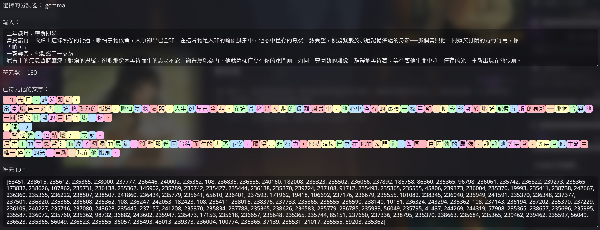
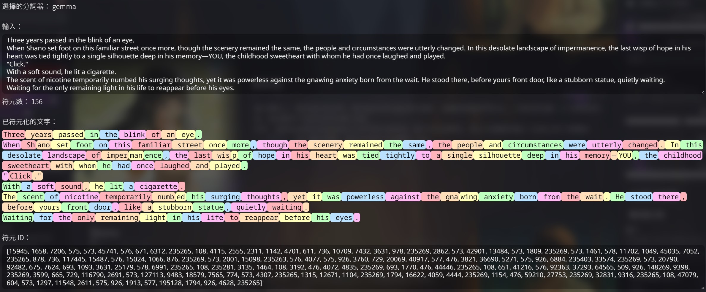
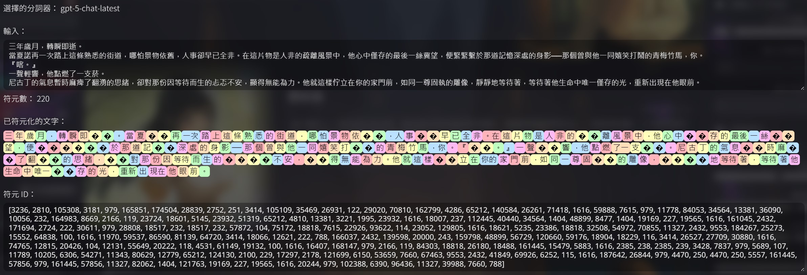
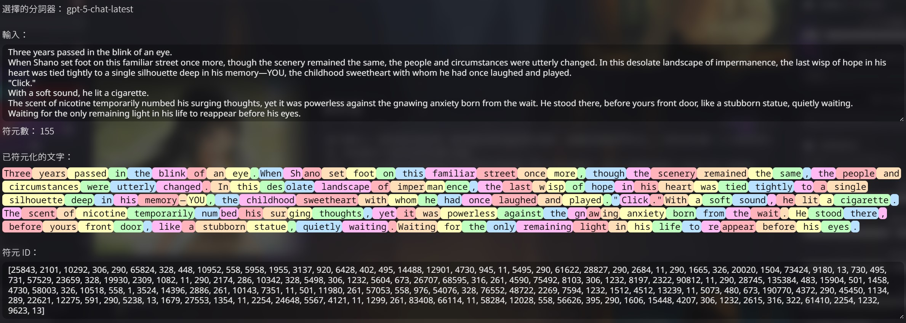
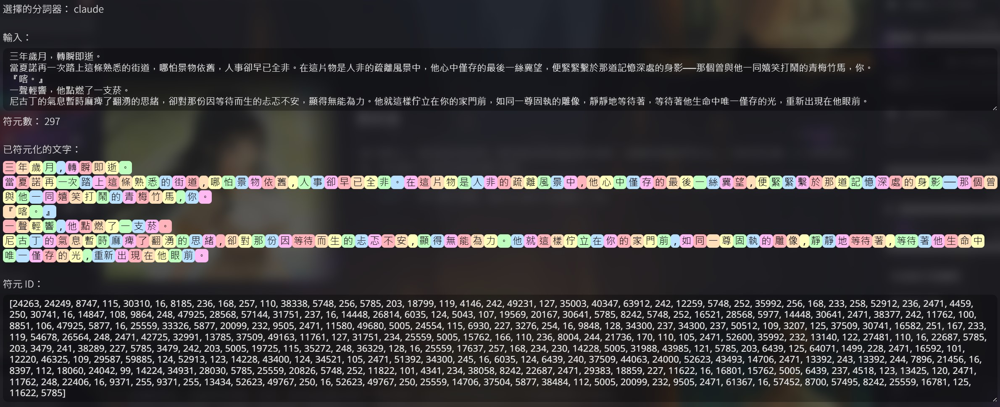
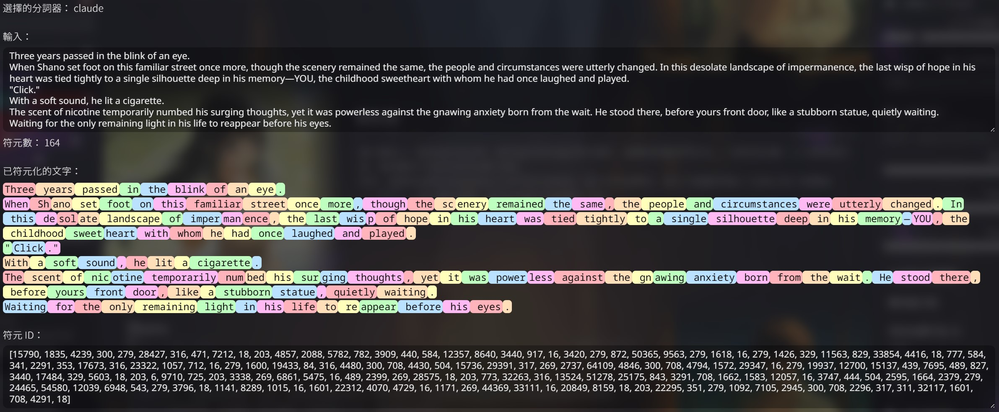
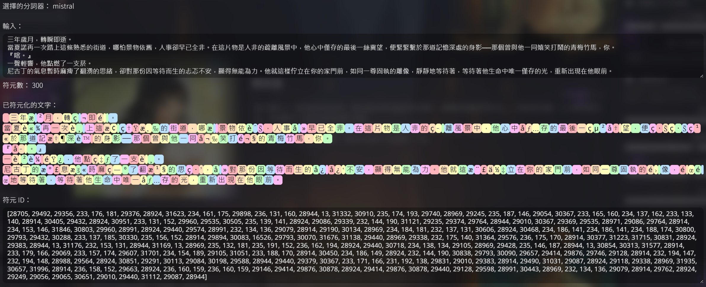
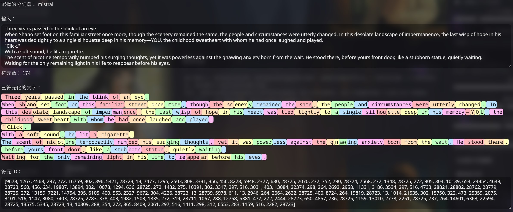

## Gemini  
堅持使用中文免費RP的最佳選擇。  

- 開發公司：Google  
- 官網頁面：[點此前往](https://gemini.google.com/app)  
- API申請頁面：[點此前往](https://aistudio.google.com/apikey)  
- API亮點：  
    - 多模態與即時資訊：不只文字，還能理解圖片與進行網路搜尋的能力。  
    - 免費方案大方：完全免費申請，每日的免費額度也提供的很大方，目前（2025/09/12）Gemini-2.5-Pro每天有50則的免費額度，Gemini-2.5-Flash更是有每天250則的免費額度。更多最新詳情請見[官方說明文件](https://ai.google.dev/gemini-api/docs/rate-limits?hl=zh-tw#free-tier)。  
    - 知識廣泛：知曉不少冷僻知識，懂得語言也多，甚至包含各地方言，用詞足夠親民。  
- API缺點：  
    - 多鄰國：可能無視使用者指示，穿插使用各國語言，例如：取而代Zi、取而代ที่、取而代에。  
    - 財哥體：多輪對話後，可能出現財哥體或其變種，且不容易挽救，例如：Google，免費，方案，很，大，方。  
    - 負面性強：容易聚焦於負面的情感，深陷不出，需要在提示詞上針對這點花上不小的心力。  
- API價格：[官方定價頁面](https://ai.google.dev/gemini-api/docs/pricing?hl=zh-tw)  
## GPT  
- 開發公司：OpenAI  
- 官網頁面：[點此前往](https://chatgpt.com/)  
- API申請頁面：[點此前往](https://platform.openai.com/settings/organization/api-keys)  
- API亮點：  
    - 待填  
- API缺點：  
    - 待填  
- API價格：  
## Claude  
- 開發公司：Anthropic  
- 官網頁面：[點此前往](https://claude.ai/new)  
- API申請頁面：[點此前往](https://console.anthropic.com/settings/keys)  
- API亮點：  
    - 待填  
- API缺點：  
    - 待填  
- API價格：  
## Mistral  
適合用來進行輔助的模型，如果願意使用英文遊玩RP，也能獨攬全局。  

- 開發公司：Mistral AI  
- 官網頁面：[點此前往](https://chat.mistral.ai/chat)  
- API申請頁面：[點此前往](https://admin.mistral.ai/organization/api-keys)  
- API亮點：  
    - 完全無審查：可以聊任何的話題，進行任何主題的RP，不過其道德感也偏高。  
    - 遵從使用者指示：對使用者下達的指令非常的遵從，如果發生拒絕的狀況，那基本只會是使用者給予的指令相互矛盾，導致其拒絕。  
    - 免費方案大方：完全免費申請，免費方案的額度正常使用下是用不完的。詳情於首次申請API並選擇使用方案時會顯示。  
    - 模型開放權重：可於[HuggingFace](https://huggingface.co/mistralai)找到幾乎所有由Mistral AI出品的模型，以及其微調模型，對於可使用自己的電腦來運行模型的使用者，選擇會非常的多樣化。  
- API缺點：  
    - 知識有限：不知道較冷僻的知識，多語言能力也有限，導致在進行中文RP時，容易詞窮並導致重複。會有很明顯的『正在學中文的外國人』感，但近期（2025/09/12）出品的Mistral-Medium-3.1（2508），中文能力已有不小的提升。  
- API價格：[官方定價頁面](https://mistral.ai/pricing#api-pricing)  
## 價格相關  
API的定價各家都是基於Tokens（符元數）的吞吐量來決定，這與各家的『分詞器』緊密相關，以下為針對同一段文章的中文版與英文版，各家分詞器計算出的Tokens（符元數）結果，Tokens（符元數）越小，越能節省遊玩花費。  
### Gemini  
  
  
### GPT  
  
  
### Claude  
  
  
### Mistral  
  
  
## 絕對禁止事項
網路上有流傳使用反向代理（Reverse Proxy，以下簡稱反代）的方法，繞開官方管道來使用API服務。  
在此提醒，此為**違法**行為，不只可能吃上**刑法詐騙**的官司，還會給所有的使用者造成嚴重負面影響。  
過往曾經有大量使用者濫用反代，繞過官方以非法途徑取得並使用Claude的服務，導致官方其後直接介入，進一步對全體使用者採取更嚴格的使用限制。  
**您的一時爽用，不僅可能讓您吃上官司，還會為全體使用者造成無窮的後患！**  
**在此呼籲各位使用正當的消費管道遊玩各家的模型，以保障你我的自身權益！**

