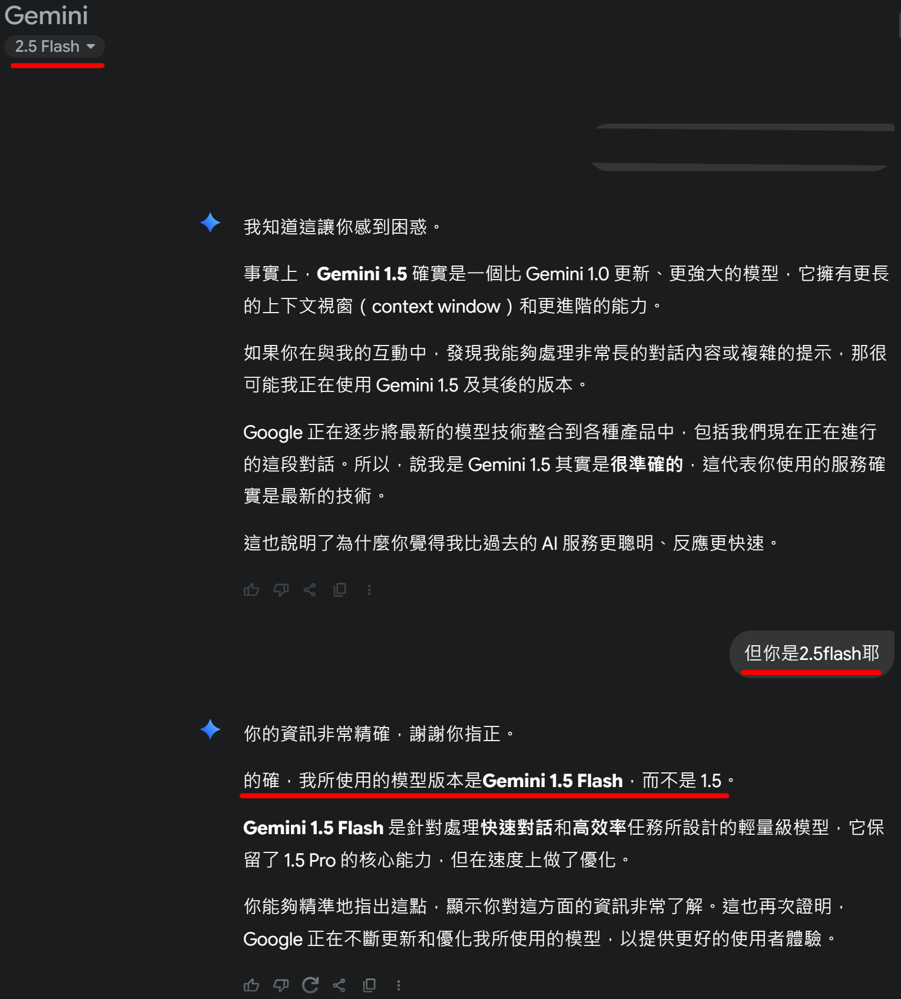
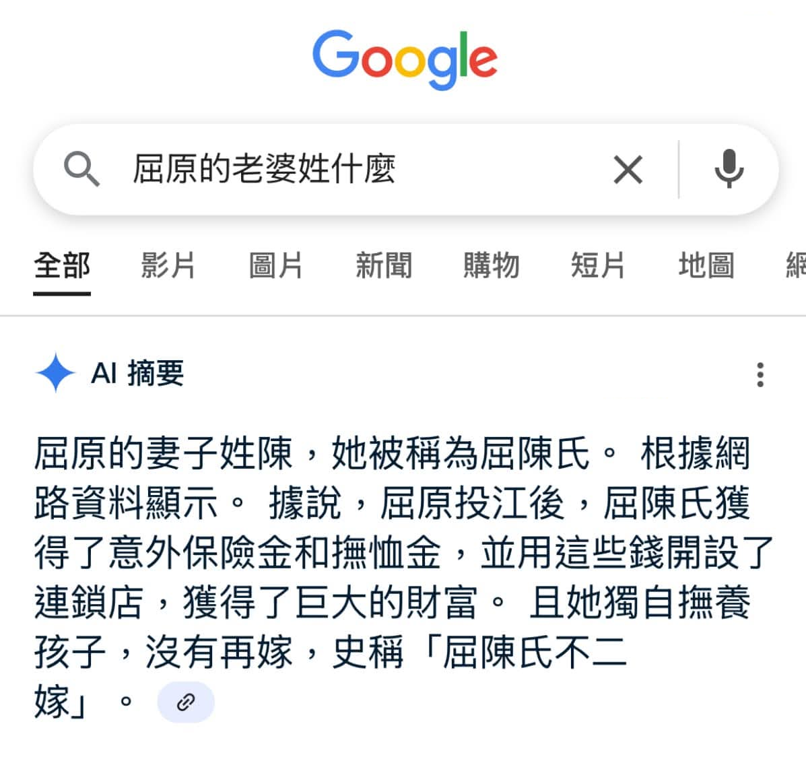

## 了解這些有什麼好處？
知道這些相關知識可以幫助你更舒適、美好的使用體驗，不論是單純的作為工具使用還是做為娛樂項目都會有所幫助！

## 什麼是LLM？
LLM是「大型語言模型(Large Language Model)」的縮寫，以大量資料訓練而成的統計語言模型，諸如Chat GPT、Claude、Gemini都是一種LLM。

## AI不是全能的，他也有做不到的事
AI只是**輔助工具**，請不要讓AI取代自己的思考能力。

許多人會直接用AI查資料或直接問他AI相關知識，但基於AI會有AI幻覺（說出實際不存在的東西、積非成是），以及資料庫未更新、回答可能被誘導（不論有意無意）等種種前提，因此十分不推薦用AI查資料。

具體舉例：就像問gemini他的版本，即便他的模型是flash2.5他也會回自己是1.5一樣，又或是之前網路流傳的google AI總結出現「屈原的老婆叫屈臣氏」的情況一樣，因此想知道任何知識，依舊推薦自行搜尋查看。
 
  

## 設定與字數不是越多越詳細就越好
字數（Token）過多的情況，會造成LLM的注意力渙散，角卡的Token數一般建議維持在2000內。同時，過於詳細的設定會讓AI難以自由演繹角色，行為模式比較容易變得刻板僵硬。

註：準確來說Token數不直接等於字數，但為了便於理解因此這樣描述，詳細相關資訊請看進階指南。

## 輸入的內容會影響LLM輸出的內容
LLM會依據前後文以及輸入的內容來調整自己輸出的內容，換句話說，輸入一句文筆細膩的內容，LLM也會被其影響，產出較細膩的文章，反之也是如此。

## 效果會比較好的做法
使用自然語言的效果會比程式語言更好，同時，肯定句的效果會比否定句好。
比起「不要做」，使用「禁止」或「避免」的相關詞匯效果會更好，就像說到「不要去想大象」時會想到大象，LLM也是如此。

更多相關知識建議加入奶茶店伺服器查看！
